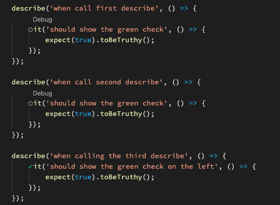

# VS CODE JEST ISSUE
This repository contains an example of a test that used with the jest extension is 
not showing the green check to inform the user that the test is valid.

## Pre conditions 
You should have installed correctly jest on your computer and you should have installed https://marketplace.visualstudio.com/items?itemName=Orta.vscode-jest in visualStudio code. 

## Issue 
Running the command: 

>yarn jest

We will notice that all the test will be succesfully executed but if we go inside the file JestExtensionIssue we will see that it's not possible to see the green check on the side of the test with the same name inside of the same file. 

